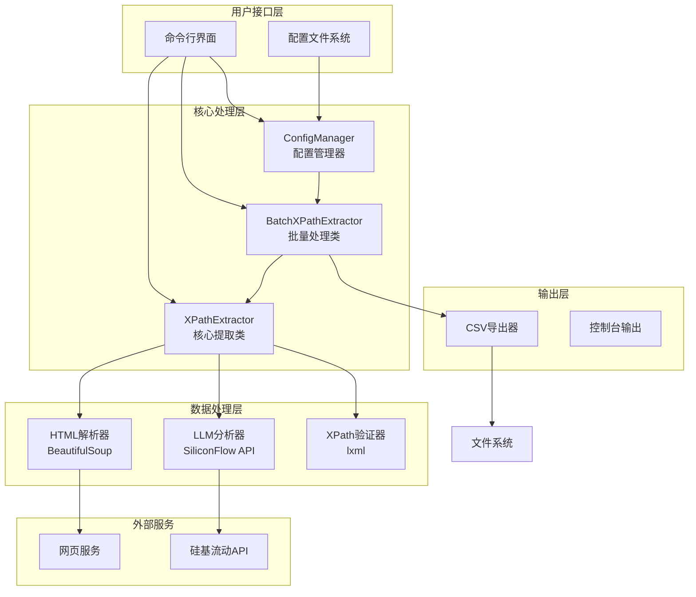
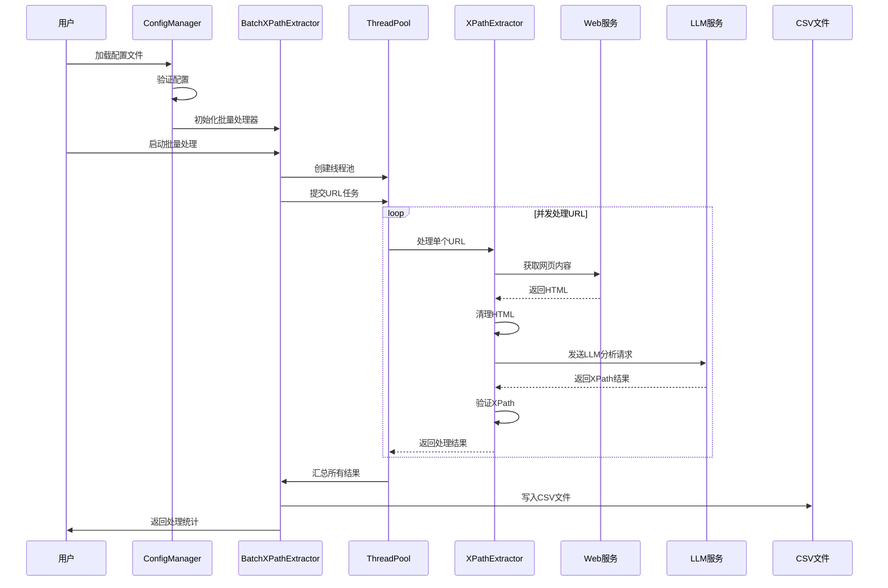
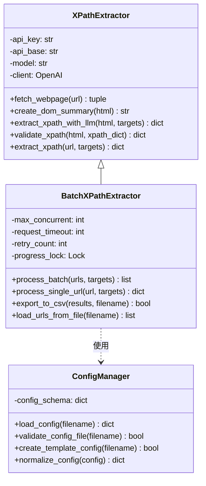
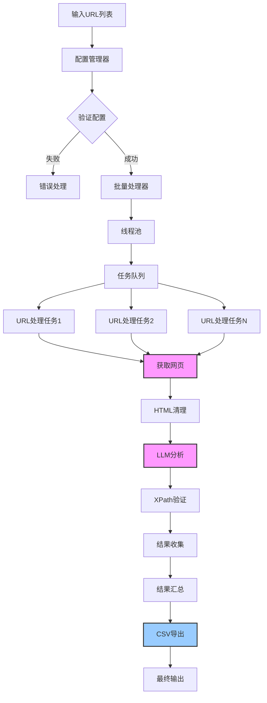
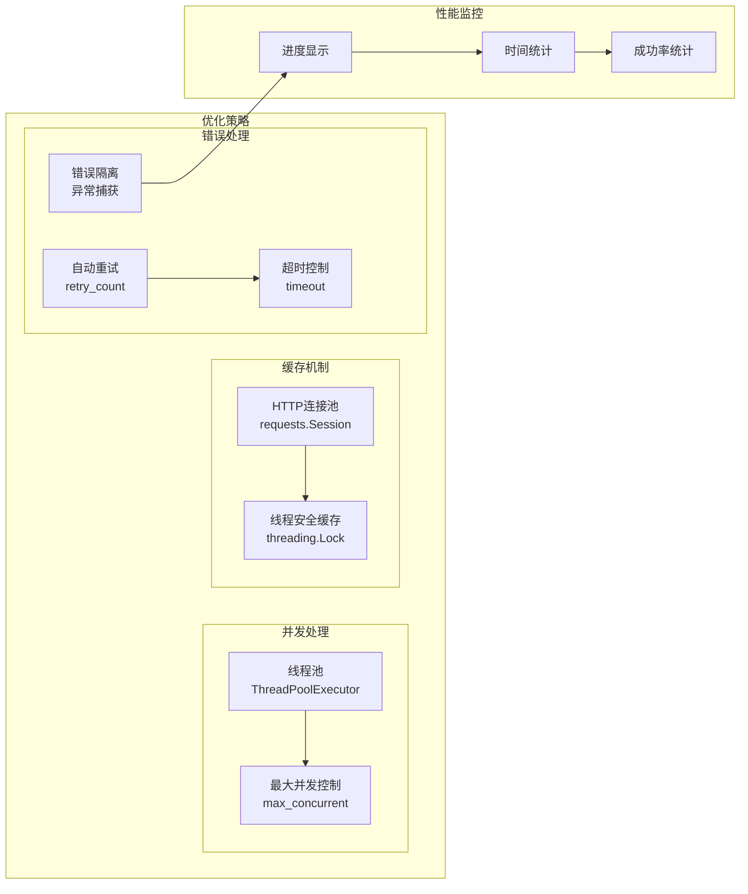
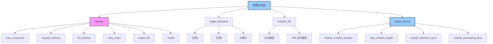
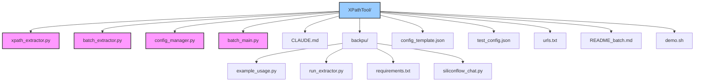

# XPath智能提取工具架构图

## 项目整体架构

```mermaid
graph TB
    subgraph "用户接口层"
        CLI[命令行界面]
        Config[配置文件系统]
    end
    
    subgraph "核心处理层"
        XPE[XPathExtractor<br/>核心提取类]
        BXPE[BatchXPathExtractor<br/>批量处理类]
        CM[ConfigManager<br/>配置管理器]
    end
    
    subgraph "数据处理层"
        HTML[HTML解析器<br/>BeautifulSoup]
        LLM[LLM分析器<br/>SiliconFlow API]
        XPath[XPath验证器<br/>lxml]
    end
    
    subgraph "输出层"
        CSV[CSV导出器]
        Console[控制台输出]
    end
    
    subgraph "外部服务"
        Web[网页服务]
        API[硅基流动API]
    end
    
    CLI --> XPE
    CLI --> BXPE
    CLI --> CM
    Config --> CM
    CM --> BXPE
    
    XPE --> HTML
    XPE --> LLM
    XPE --> XPath
    
    BXPE --> XPE
    BXPE --> CSV
    
    HTML --> Web
    LLM --> API
    CSV --> File[文件系统]
```

## 批量处理流程

```mermaid
sequenceDiagram
    participant U as 用户
    participant C as ConfigManager
    participant B as BatchXPathExtractor
    participant P as ThreadPool
    participant X as XPathExtractor
    participant W as Web服务
    participant L as LLM服务
    participant F as CSV文件
    
    U->>C: 加载配置文件
    C->>C: 验证配置
    C->>B: 初始化批量处理器
    
    U->>B: 启动批量处理
    B->>P: 创建线程池
    B->>P: 提交URL任务
    
    loop 并发处理URL
        P->>X: 处理单个URL
        X->>W: 获取网页内容
        W-->>X: 返回HTML
        X->>X: 清理HTML
        X->>L: 发送LLM分析请求
        L-->>X: 返回XPath结果
        X->>X: 验证XPath
        X-->>P: 返回处理结果
    end
    
    P->>B: 汇总所有结果
    B->>F: 写入CSV文件
    B->>U: 返回处理统计
```

## 类继承关系

```mermaid
classDiagram
    class XPathExtractor {
        -api_key: str
        -api_base: str
        -model: str
        -client: OpenAI
        +fetch_webpage(url) tuple
        +create_dom_summary(html) str
        +extract_xpath_with_llm(html, targets) dict
        +validate_xpath(html, xpath_dict) dict
        +extract_xpath(url, targets) dict
    }
    
    class BatchXPathExtractor {
        -max_concurrent: int
        -request_timeout: int
        -retry_count: int
        -progress_lock: Lock
        +process_batch(urls, targets) list
        +process_single_url(url, targets) dict
        +export_to_csv(results, filename) bool
        +load_urls_from_file(filename) list
    }
    
    class ConfigManager {
        -config_schema: dict
        +load_config(filename) dict
        +validate_config_file(filename) bool
        +create_template_config(filename) bool
        +normalize_config(config) dict
    }
    
    XPathExtractor <|-- BatchXPathExtractor
    BatchXPathExtractor ..> ConfigManager : 使用
```

## 数据流图

```mermaid
flowchart TD
    A[输入URL列表] --> B[配置管理器]
    B --> C{验证配置}
    C -->|失败| D[错误处理]
    C -->|成功| E[批量处理器]
    
    E --> F[线程池]
    F --> G[任务队列]
    
    G --> H[URL处理任务1]
    G --> I[URL处理任务2]
    G --> J[URL处理任务N]
    
    H --> K[获取网页]
    I --> K
    J --> K
    
    K --> L[HTML清理]
    L --> M[LLM分析]
    M --> N[XPath验证]
    N --> O[结果收集]
    
    O --> P[结果汇总]
    P --> Q[CSV导出]
    Q --> R[最终输出]
    
    style K fill:#f9f,stroke:#333,stroke-width:2px
    style M fill:#f9f,stroke:#333,stroke-width:2px
    style Q fill:#9cf,stroke:#333,stroke-width:2px
```

## 性能优化架构

```mermaid
graph LR
    subgraph "优化策略"
        subgraph "并发处理"
            TP[线程池<br/>ThreadPoolExecutor]
            MC[最大并发控制<br/>max_concurrent]
        end
        
        subgraph "缓存机制"
            HC[HTTP连接池<br/>requests.Session]
            TC[线程安全缓存<br/>threading.Lock]
        end
        
        subgraph "错误处理"
            RT[自动重试<br/>retry_count]
            TO[超时控制<br/>timeout]
            EH[错误隔离<br/>异常捕获]
        end
    end
    
    subgraph "性能监控"
        PS[进度显示]
        TS[时间统计]
        RS[成功率统计]
    end
    
    TP --> MC
    HC --> TC
    RT --> TO
    EH --> PS
    PS --> TS
    TS --> RS
```

## 配置文件结构

```mermaid
graph TD
    A[配置文件根] --> B[settings]
    A --> C[target_elements]
    A --> D[urls/urls_file]
    A --> E[output_format]
    
    B --> B1[max_concurrent]
    B --> B2[request_timeout]
    B --> B3[llm_timeout]
    B --> B4[retry_count]
    B --> B5[output_file]
    B --> B6[model]
    
    C --> C1[元素1]
    C --> C2[元素2]
    C --> C3[元素N]
    
    D --> D1[URL数组]
    D --> D2[URL文件路径]
    
    E --> E1[include_content_preview]
    E --> E2[max_content_length]
    E --> E3[include_element_count]
    E --> E4[include_processing_time]
    
    style A fill:#9cf,stroke:#333,stroke-width:2px
    style B fill:#f9f,stroke:#333,stroke-width:2px
    style E fill:#9cf,stroke:#333,stroke-width:2px
```

## 项目文件结构

```mermaid
graph TD
    A[XPathTool/] --> B[xpath_extractor.py]
    A --> C[batch_extractor.py]
    A --> D[config_manager.py]
    A --> E[batch_main.py]
    A --> F[CLAUDE.md]
    A --> G[backpu/]
    A --> H[config_template.json]
    A --> I[test_config.json]
    A --> J[urls.txt]
    A --> K[README_batch.md]
    A --> L[demo.sh]
    
    G --> G1[example_usage.py]
    G --> G2[run_extractor.py]
    G --> G3[requirements.txt]
    G --> G4[siliconflow_chat.py]
    
    style A fill:#9cf,stroke:#333,stroke-width:2px
    style B fill:#f9f,stroke:#333,stroke-width:2px
    style C fill:#f9f,stroke:#333,stroke-width:2px
    style D fill:#f9f,stroke:#333,stroke-width:2px
    style E fill:#f9f,stroke:#333,stroke-width:2px
```